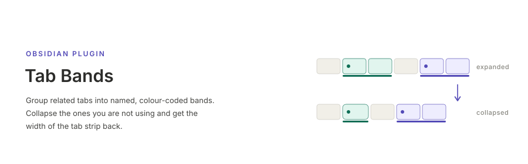

[English](README.md) | **日本語**

# Tab Bands

Obsidian のタブストリップに，名前つき・色つき・折りたためる**バンド**を重ねる
プラグイン．関連するタブをまとめ，使わないバンドは畳んでタブ列の幅を取り戻せる．
バンドは再起動をまたいで保持され，折りたたんでも leaf を detach しないので，
エディタのスクロール位置や未保存の編集は失われない．

> [!WARNING]
> **本プラグインは非公式 API に依存している．** 公開 d.ts に無いプロパティ
> (`WorkspaceLeaf.id`，`WorkspaceParent.children` など) と Obsidian の DOM 構造を
> 前提にしているため，本体の更新で予告なく動作しなくなる可能性がある．
> 壊れたときは，装飾が出ない・再起動でバンドが消える・折りたたみが効かない，
> といった症状になる．**ノート本体には影響しない**．バンドの情報はプラグイン
> フォルダの `data.json` にだけ持ち，プラグインを無効化すればタブストリップは
> 通常の状態に戻る．一覧と個別の症状は
> [非公式 API への依存](docs/unofficial-api.ja.md) にまとめてある．

## インストール

コミュニティプラグイン一覧には未登録のため，手動で導入する．

1. [Releases](https://github.com/akitenkrad/obsidian-tab-bands/releases) の最新版から
   `main.js` / `manifest.json` / `styles.css` の 3 ファイルをダウンロードする．
2. `<vault>/.obsidian/plugins/tab-bands/` に 3 ファイルをそのまま置く．
   ディレクトリ名は `manifest.json` の `id` と一致している必要がある．
3. 設定 → コミュニティプラグイン → (制限モードなら解除) → 再読み込み →
   **Tab Bands** を有効化．

デスクトップ専用 (`isDesktopOnly: true`)．Obsidian 1.7.0 以降が必要．更新するときは
同じ 3 ファイルを上書きして Obsidian を再読み込みする．同じフォルダの `data.json` に
バンドの情報が入っているので消さないこと．

## ドキュメント

- [使い方](docs/usage.ja.md) — 操作，バンドの名前，新規タブが自動で参加する条件，
  既知の制限
- [非公式 API への依存](docs/unofficial-api.ja.md) — 何に依存していて，
  それぞれ失われると何が壊れるか
- [内部構造](docs/internals.ja.md) — 設計方針，Obsidian について実測で分かったこと，
  実装メモ
- [開発](docs/development.ja.md) — ビルド，テスト，CI，リリース手順

## ライセンス

MIT．[LICENSE](LICENSE) を参照．
